<!-- pandoc readme.md -o 11429074.pdf -f markdown+auto_identifiers -s -V papersize:"a4paper" -->

# Email web application

This is a simple web-based email system, using JavaServer Pages and Java Servlets and backed by a MySQL database.

It follows a Model-View-Controller pattern. Browser actions GET and POST are handled by controller Servlets, which pass data to JSP views, which handle how the page is displayed in the browser. Database actions are handled by Data Access Objects (DAO), which generally translate database data into instances of the model classes.

## Database

Users have a unique username, which is also the primary key of the `users` table. Hashed and salted passwords are stored with their salt.

Messages have an automatically incremented id and use the text data type for the body of the message. As messages can be sent to muliple recipients, the recipients are stored in another table.

The `recipients` table has a row for each recipient of each message. It includes a boolean value `trash` which indicates if it should be displayed in the Inbox or Trash.

# Build and Deploy

## Pre-requisites

I tested using Tomcat 7 and MySQL 14.14 on Ubuntu:

```
$ /usr/share/tomcat7/bin/version.sh
Using CATALINA_BASE:   /usr/share/tomcat7
Using CATALINA_HOME:   /usr/share/tomcat7
Using CATALINA_TMPDIR: /usr/share/tomcat7/temp
Using JRE_HOME:        /usr
Using CLASSPATH:       /usr/share/tomcat7/bin/bootstrap.jar:/usr/share/tomcat7/bin/tomcat-juli.jar
Server version: Apache Tomcat/7.0.52 (Ubuntu)
Server built:   Jul 24 2014 08:38:51
Server number:  7.0.52.0
OS Name:        Linux
OS Version:     3.13.0-34-generic
Architecture:   amd64
JVM Version:    1.7.0_65-b32
JVM Vendor:     Oracle Corporation
```

```
$ mysql -V
mysql  Ver 14.14 Distrib 5.5.38, for debian-linux-gnu (x86_64) using readline 6.3
```

The following libraries should be in the directory `WebContent/WEB-INF/lib`

```
catalina-ant.jar
jstl-1.2.jar
mysql.jar
tomcat-coyote.jar
tomcat-juli.jar
tomcat-util.jar
```

## Database setup

The application uses MySQL as its database.
To create the database and tables, run this command:

```bash
mysql -u root -p < database.sql
```

After the database is created, load the demo data with:

```bash
mysql -u root -p ST11429074email < demo.sql
```

This includes the users and data as seen in the screenshots [below](#run). All users have their username as their password.

The application uses a properties file `WebContent/WEB-INF/db.properties`.
Edit this file to select a database server. The user will need read and write access to the database. The default values are:

```properties
user=root
password=abc123
server=localhost
port=3306
database=ST11429074email
```

## Deploy

I built and deployed using ant and Tomcat Manager:

```bash
ant deploy
```

You could also build hotel.war and deploy to Tomcat via the admin gui.  
Create the war file with `ant war`, then deploy using the Tomcat Manager page.

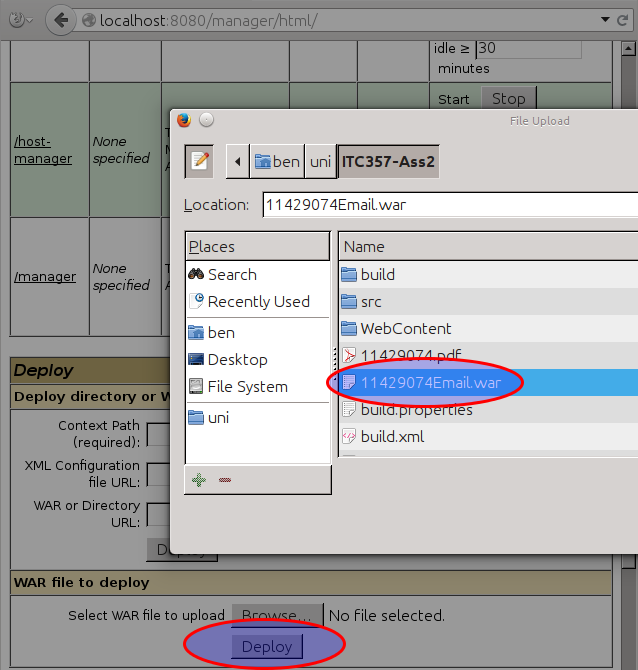
\FloatBarrier

\newpage

# Run

Browse to the context path [http://localhost:8080/11429074Email/](http://localhost:8080/11429074Email/):  

## Sign up

When signing up, the chosen username is checked against existing usernames to warn against duplicates.

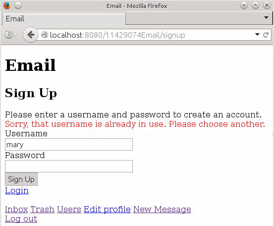
\FloatBarrier

After successfully signing up, the user is redirected to the login page and invited to log in.  
Passwords are hashed using password-based encryption. A [`PBEKeySpec`](http://docs.oracle.com/javase/7/docs/api/javax/crypto/spec/PBEKeySpec.html) is created with the chosen password and a salt which is generated using [`SecureRandom`](http://docs.oracle.com/javase/7/docs/api/java/security/SecureRandom.html). The hash is generated using [`SecretKey`](http://docs.oracle.com/javase/7/docs/api/javax/crypto/SecretKey.html) with the [PBKDF2WithHmacSHA1 algorithm](http://docs.oracle.com/javase/7/docs/technotes/guides/security/StandardNames.html#SecretKeyFactory). The hashed password and salt are stored with the username in the database.

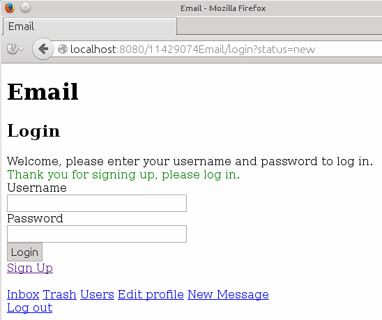
\FloatBarrier

## Log in

Pages that require a login to view are under the path `secure`. The filter `SessionFilter` is applied to that path to check if a user is logged in. When you attempt to browse to such a page without being logged in, you will be directed to the login page.

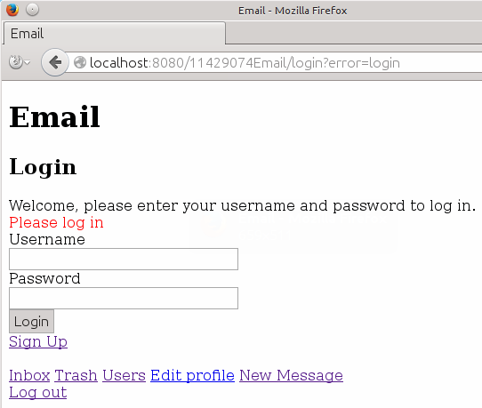
\FloatBarrier

When the login button is clicked, the application checks that a username and password have been entered.

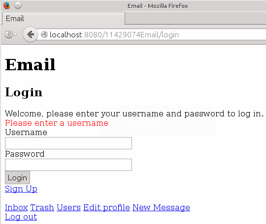
\FloatBarrier

When a username and password is entered, the application checks the combination against the database.

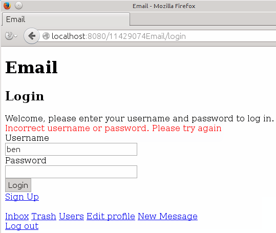
\FloatBarrier

Logging in takes the user to their Inbox. There is a row of links at the bottom of every page for accessing all the functions of the application.

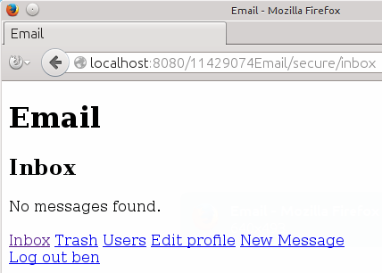
\FloatBarrier

## Your profile

Clicking *Edit Profile* takes the user to their profile page, which includes a form for updating their details.

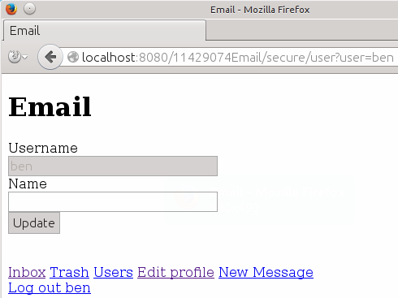
\FloatBarrier

The user can enter their name and click *Update*.

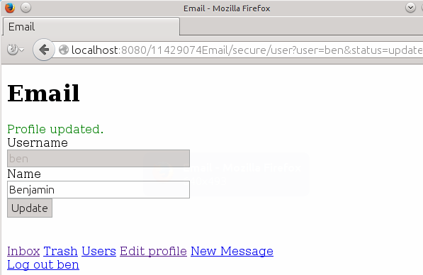
\FloatBarrier

## User list

Clicking the *Users* link takes the user to a list of all registered users. From here they can view another user's profile or send a message.

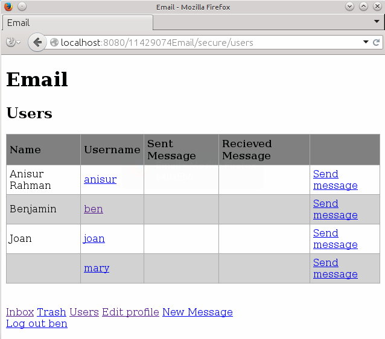
\FloatBarrier

If the user clicks the username of another user, they can view that user's profile.


\FloatBarrier

## Sending messages

Clicking the *Send Message* link on the Profile or the User List directs the user to the New Message page with the *To* field pre-filled.

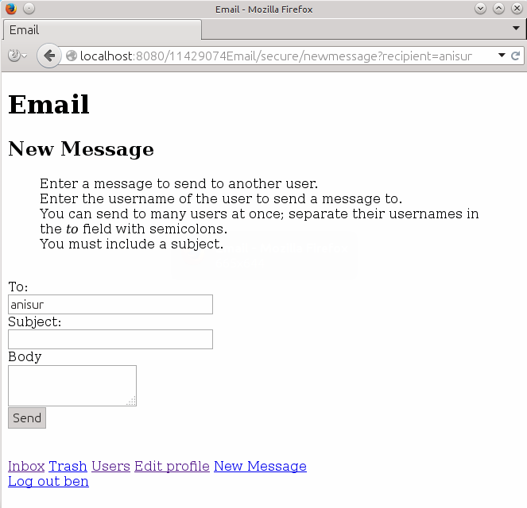
\FloatBarrier

When attempting to send a message, the application checks that a recipient and a subject have been entered.

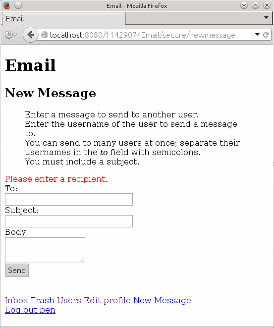
\FloatBarrier

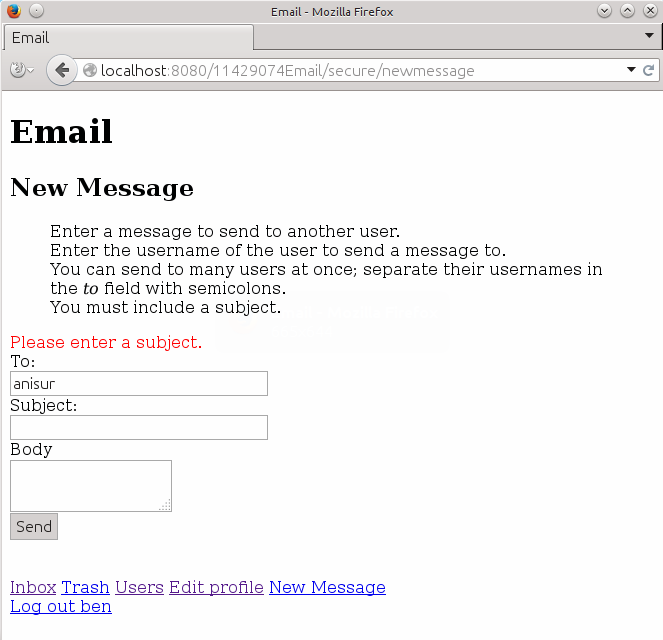
\FloatBarrier

The application will also warn the user if the recipient doesn't exist.

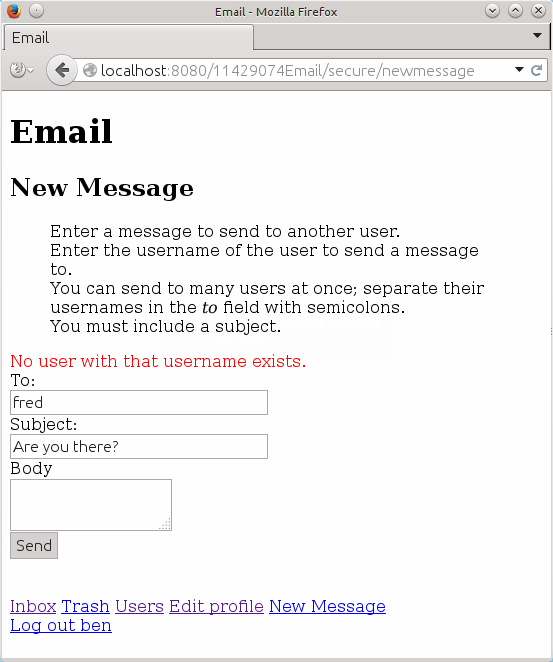
\FloatBarrier

After a message is sent, the user is redirected to the Inbox.

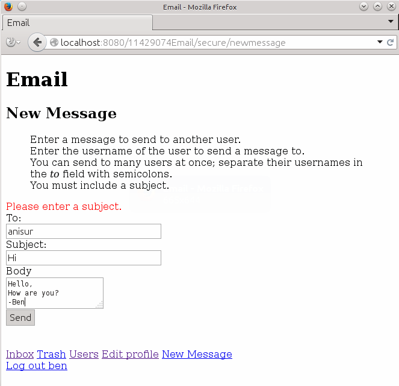
\FloatBarrier

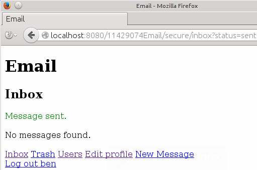
\FloatBarrier

The User List is updated to show that a message has been sent to that user.

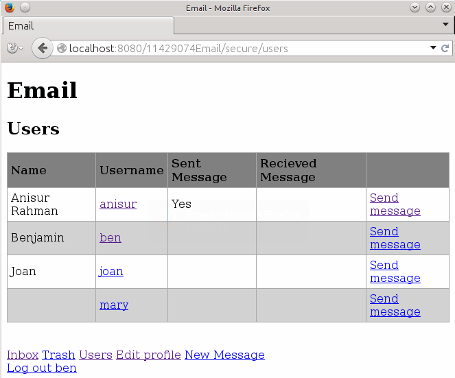
\FloatBarrier

### Multiple recipients

Messages can be sent to mulitple recipients by specified many usernames separated with semicolons.

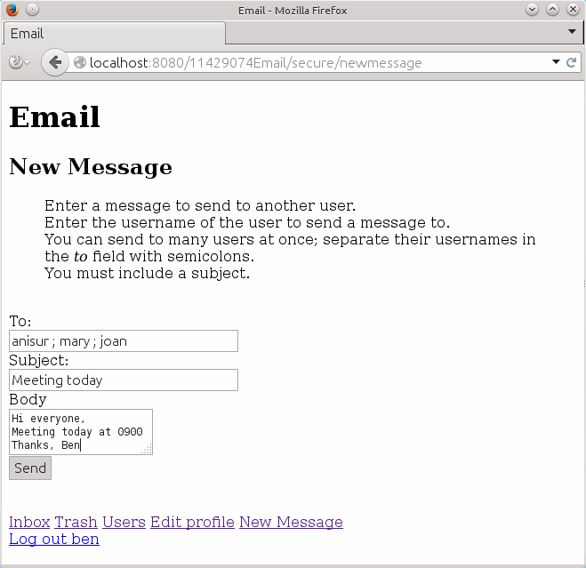
\FloatBarrier

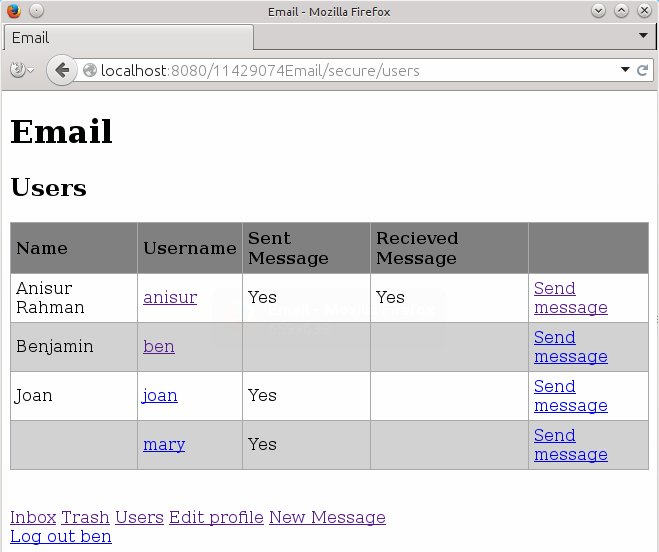
\FloatBarrier

## Receiving messages

Received messages appear in the Inbox.

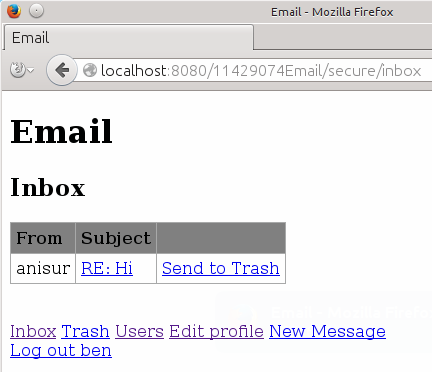
\FloatBarrier

The user can click the subject to view the message.

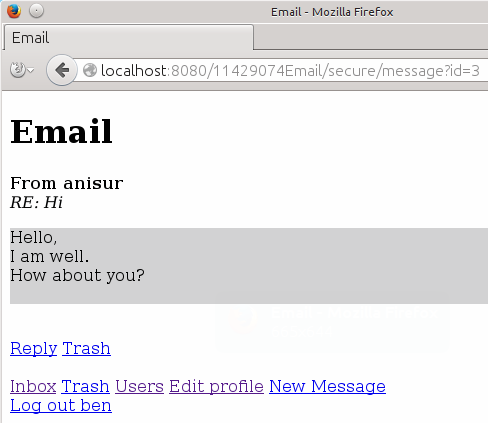
\FloatBarrier

The user can click *Reply* to reply to the message.
The *To* and *Subject* fields are pre-filled.

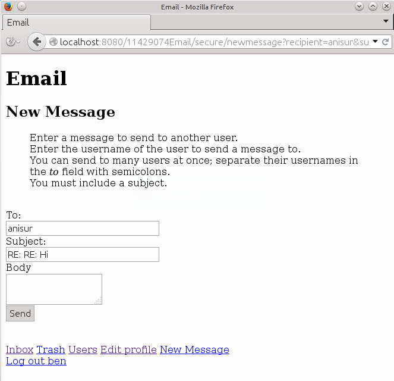
\FloatBarrier

The User List is updated to show that a message has been recived from that user.

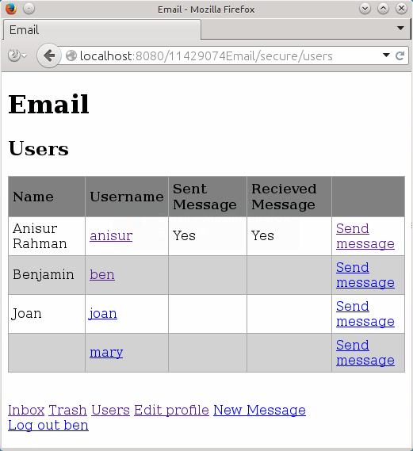
\FloatBarrier

## Trash  

From the Message or Inbox, the user can send messages to the Trash.
This sets the `trash` column in the `recipients` table to true.

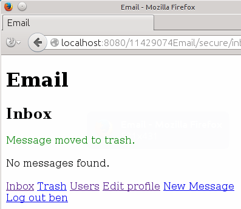
\FloatBarrier

Messages in the Trash can be moved back to the Inbox.

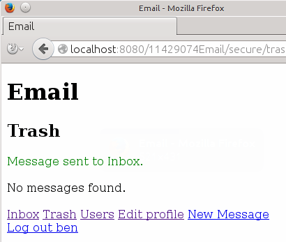
\FloatBarrier

Messages can be deleted from Trash.
Deleting a message deletes the row for that message for the current user from the `recipients` table. If the are no recipients for a message, that message is deleted from the `messages` table.

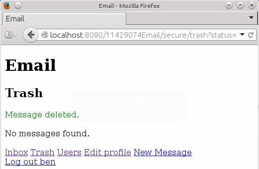
\FloatBarrier

## Logout

Clicking *Logout* invalidates the user's session and redirects the user to the login page.

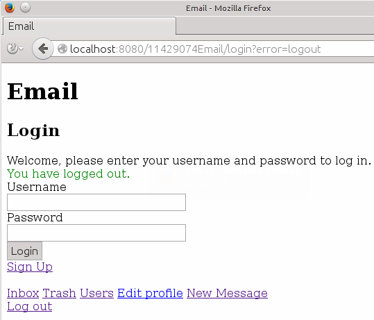
\FloatBarrier
